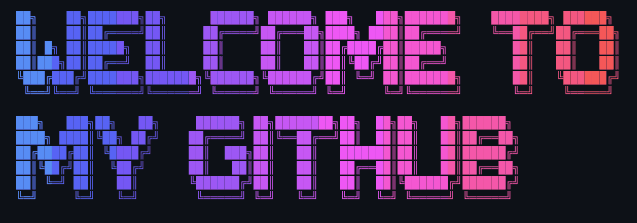

  

  

A **Full-Stack Engineer** with a concentration in **ML/AI**, passionate about building data-driven systems that solve meaningful, real-world problems. My work sits at the intersection of software engineering, artificial intelligence, and economic development, by crafting scalable tools that improve decision-making and expand opportunity in resource-constrained environments. I believe technology is not just about innovation... it's about impact.

---

### About Me

*   🎓 **B.S. Computer Science** — Georgia State University
*   🌍 Based in **Atlanta, GA**
*   🖥️ Portfolio: **[alfallatah.dev](https://alfallatah.dev)**
*   ✉️ Reach me: **[omr.alflata@gmail.com](mailto:omr.alflata@gmail.com)**
*   🧠 Currently leveling up: **Django** & **React**
*   🤝 Open to collaborating on: Data pipelines, AI-integrated apps, or anything with real-world impact.
*   💬 Ask me about: **Python, FastAPI, PostgreSQL, ML Engineering, Backend Systems**
*   ⚡ Philosophy: *Problem first, tools second. Build for impact, not just output.*

---

### My Tech Stack

**Languages:**

  
  
  

**Frontend:**

  
  
  
  
  

**Backend & APIs:**

  
  
  
  

**Databases & Cloud:**

  
  
  

**Tools & Design:**

  
  

---

### GitHub Stats

<!-- START GITHUB STATS -->
The deployment is currently unavailable

DEPLOYMENT_PAUSED

iad1::tbzgn-1771806484031-f39f97481f17
The deployment is currently unavailable

DEPLOYMENT_PAUSED

iad1::plrph-1771806302673-5eb0ada2f9c0
The deployment is currently unavailable

DEPLOYMENT_PAUSED

iad1::5jswf-1771805395000-699c38d0e608
<!-- SVG will be injected here by workflow -->

---

### Let's Connect

I'm open to collaboration, conversations about data-driven systems, and really anything fun.

📬 **[omr.alflata@gmail.com](mailto:omr.alflata@gmail.com)** · 🌐 **[alfallatah.dev](https://alfallatah.dev)**
